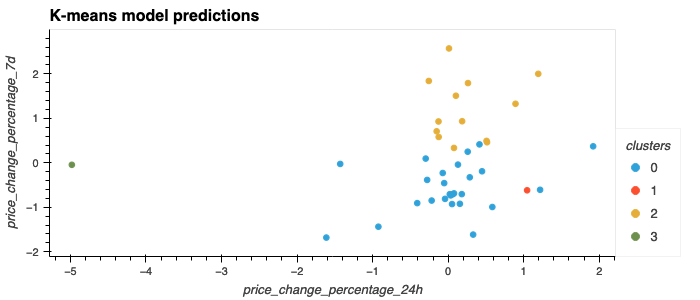
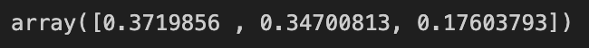
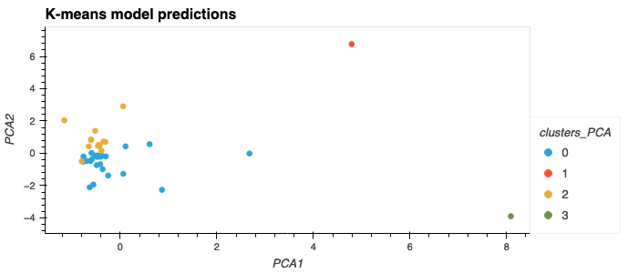

# Cryptocurrency Clustering Challenge

In this challenge, knowledge of Python and unsupervised learning are used to predict if cryptocurrencies are affected by 24-hour or 7-day price changes.

1. Prepare the Data: Use StandardScaler() to normalize the data.

**Original Data**

**Scaled Data**

2. Find the Best Value for k Using the Original Scaled DataFrame

- What is the best value for k?
**4**

3. Cluster Cryptocurrencies with K-means Using the Original Scaled Data

4. Optimize Clusters with Principal Component Analysis

-What is the total explained variance of the three principal components?
**89.50%**

**PCA DataFrame**

5. Find the Best Value for k Using the PCA Data

-What is the best value for k when using the PCA data?
**4**

-Does it differ from the best k value found using the original data?
**No, the best value for `k` is the same**

6. Cluster Cryptocurrencies with K-means Using the PCA Data

7. Visualize and Compare the Results

-What is the impact of using fewer features to cluster the data using K-Means?
