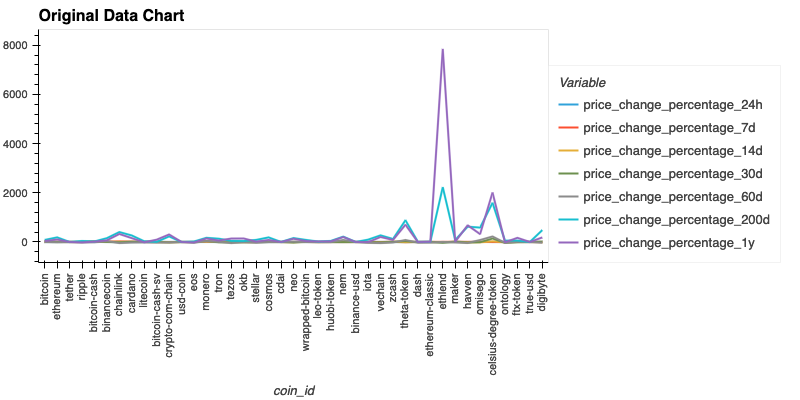

# Cryptocurrency Clustering Challenge

In this challenge, knowledge of Python and unsupervised learning are used to predict if cryptocurrencies are affected by 24-hour or 7-day price changes.

1. Prepare the Data: Use StandardScaler() to normalize the data.

**Original Data**

**Scaled Data**

2. Find the Best Value for k Using the Original Scaled DataFrame

- What is the best value for k?
**4**

3. Cluster Cryptocurrencies with K-means Using the Original Scaled Data

4. Optimize Clusters with Principal Component Analysis

5. Find the Best Value for k Using the PCA Data

6. Cluster Cryptocurrencies with K-means Using the PCA Data

