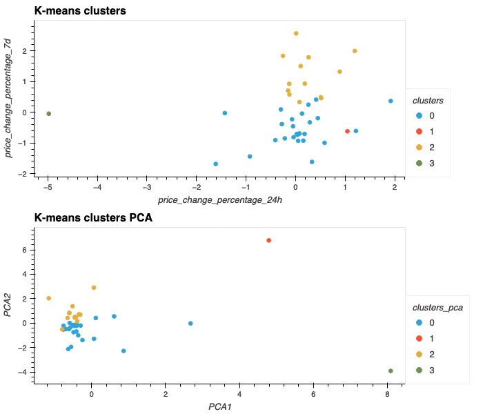

# Cryptocurrency Clustering Challenge

In this challenge, knowledge of Python and unsupervised learning are used to predict if cryptocurrencies are affected by 24-hour or 7-day price changes.

## 1. Prepare the Data: Use StandardScaler() to normalize the data.

**Original Data**

**Scaled Data**

## 2. Find the Best Value for k Using the Original Scaled DataFrame

- What is the best value for k?
**4**

## 3. Cluster Cryptocurrencies with K-means Using the Original Scaled Data

## 4. Optimize Clusters with Principal Component Analysis

**PCA Data**

**PCA Variances**

-What is the total explained variance of the three principal components?
**89.50%**

**PCA DataFrame**

## 5. Find the Best Value for k Using the PCA Data

-What is the best value for k when using the PCA data?
**4**

-Does it differ from the best k value found using the original data?
**No, the best value for `k` is the same**

## 6. Cluster Cryptocurrencies with K-means Using the PCA Data

## 7. Visualize and Compare the Results

**Composite Elbow Chart**

**Composite K-means Clusters Chart**

**Comparison DataFrame for the clusters with and without PCA**

-What is the impact of using fewer features to cluster the data using K-Means?

    **The Composite Elbow Chart shows how when using the PCA method we obtained the same optimal `k`.**

    **Also, the Composite K-means Clusters chart shows how the cryptos were grouped in the same clusters, which can be seen also in comparison Dataframe.**
  
    **This confirms that the PCA is a useful method to use when working with large datasets that require dimensionality reduction. As the principal components explain the variances in the data, then, when applying the k-means clustering method, we are able to obtain similar results.**
